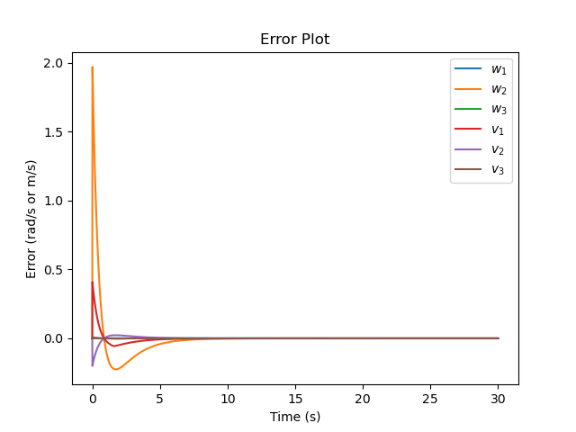

# Kuka youBot Mobile Manipulation
Repository for Northwestern's ME 449 capstone project (Fall'23). Full project description can be found [here](https://hades.mech.northwestern.edu/index.php/Mobile_Manipulation_Capstone_2023).

## Overview
This repository contains code to simulate a pick-and-place task using a Kuka youBot mobile manipulator (a mobile base with four mecanum wheels and a 5R robot arm) in CoppeliaSim.

`mobile_manipulation.py` generates a comma-separated values (csv) text file that specifies the configurations of the chassis and the arm, the angles of the four wheels, and the state of the gripper (open or closed) as a function of time. This file is used to simulate the trajectory in CoppeliaSim to validate successful completion of the pick-and-place operation. The video below shows the output csv file simulated in CoppeliaSim.

## Simulation Demo

https://private-user-images.githubusercontent.com/72541517/316711428-2907d867-b8aa-42d2-beeb-9ac283376097.mp4?jwt=eyJhbGciOiJIUzI1NiIsInR5cCI6IkpXVCJ9.eyJpc3MiOiJnaXRodWIuY29tIiwiYXVkIjoicmF3LmdpdGh1YnVzZXJjb250ZW50LmNvbSIsImtleSI6ImtleTUiLCJleHAiOjE3MTE0MjE4NjEsIm5iZiI6MTcxMTQyMTU2MSwicGF0aCI6Ii83MjU0MTUxNy8zMTY3MTE0MjgtMjkwN2Q4NjctYjhhYS00MmQyLWJlZWItOWFjMjgzMzc2MDk3Lm1wND9YLUFtei1BbGdvcml0aG09QVdTNC1ITUFDLVNIQTI1NiZYLUFtei1DcmVkZW50aWFsPUFLSUFWQ09EWUxTQTUzUFFLNFpBJTJGMjAyNDAzMjYlMkZ1cy1lYXN0LTElMkZzMyUyRmF3czRfcmVxdWVzdCZYLUFtei1EYXRlPTIwMjQwMzI2VDAyNTI0MVomWC1BbXotRXhwaXJlcz0zMDAmWC1BbXotU2lnbmF0dXJlPTJlYTllOTc0ZDgyYzczOTE1MDk3ZTM5MjUzNzVmOWEwOTBlY2RjZGVlYzY4YTM4NWUyNTc4MTBlODAwNTVlYmYmWC1BbXotU2lnbmVkSGVhZGVycz1ob3N0JmFjdG9yX2lkPTAma2V5X2lkPTAmcmVwb19pZD0wIn0.r1CucRc_hmDuEgWA54I_9RdnH_9ndy1guSrbDMDn6pE


## Package Description
This project is packaged into 3 Python modules (milestones): <br>

1. `next_state.py` - Milestone 1 code. The function `NextState()` computes the configuration of the robot for the next time step using first-order Euler integration.<br>
2. `trajectory_generator.py` - Milestone 2 code. The function `TrajectoryGenerator()` generates the reference trajectory for the robot's end effector.<br>
3. `feedback_control.py` - Milestone 3 code. The function `FeedbackControl()` uses kinematic task-space feedforward plus feedback control to continuously reduce deviations from the reference trajectory.<br>
4. `mobile_manipulation.py` - Full Program Implementation. Uses the functions defined in the 3 milestone modules to generate the robot trajectory.

## Results
For the simuation shown above these are the results.

### Simulation conditions:
Intial robot configuration:
```
[0.0, -0.3, 0.2, 0.0, 0.0, 0.9, -0.5, 0.0, 0.0, 0.0, 0.0, 0.0]
```

Initial cube configuration:
```
[[1, 0, 0, 1.0],
[0, 1, 0, 0.0],
[0, 0, 1, 0.025],
[0, 0, 0, 1]]
```

Final cube configuration:
```
[[0, 1, 0, 0],
[-1, 0, 0, -1],
[0, 0, 1, 0.025],
[0, 0, 0, 1]]
```

Motion Planning using different feedback controller gains:

1. For a PI controller with feedback gains of Kp = 2.5 and Ki = 1.2, the error plot is:

   <p align="center">
     
   </p>

   \- No overshoot, no steady-state error, and a fast settling time.

2. For a PI controller with feedback gains of Kp = 2.5 and Ki = 0.001, the error plot is:

   <p align="center">
     
   </p>

   \- Some overshoot at the beginning, no steady-state error, and a fast settling time.

   \- Note: This simulation uses a slightly different starting robot configuration.
